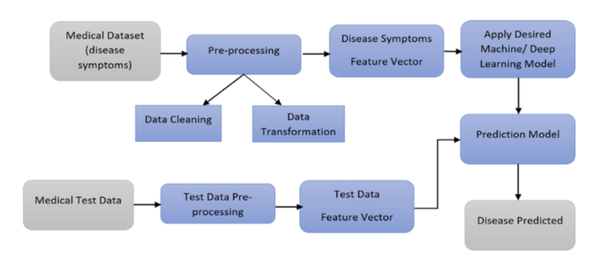

# Medical-Diagnosis-Using-AI
Using Machine Learning algorithms to predict the Lung disease, Diabetics, Parkinson's disease, Thyroid and Heart diseases.

**Problem Statement**

In today's healthcare system, medical diagnosis is often prone to human error or delays, as doctors face increasing amounts of patient data-symptoms, medical history, lab results, and imaging-making it hard to analyze everything quickly.
The complexity of diseases and varied patient symptoms further complicate decision-making, especially in high-pressure or resource-limited settings.
Key Challenges:
Complexity & High Stakes
Data Overload
Misdiagnosis Risks
Challenges in Disease Complexity

**Proposed Solution**

Al can streamline medical diagnosis by analyzing large volumes of patient data-symptoms, history, labs, and imaging-quickly and accurately.
In high-pressure settings like emergency rooms, Al can help detect critical conditions, such as heart attacks, reducing the risk of misdiagnosis.
By processing EHRs efficiently, Al ensures no crucial data is overlooked, supporting doctors in making faster, more informed decisions, even in complex or resource-limited scenarios.
This leads to improved accuracy, reduced diagnostic delays, and better patient outcomes.

**System Architecture**

**Software Requirements**

Frontend: Streamlit
Backend: Python
Model: SVM, Logistic Regression, Randomforest
Framework: Sklearn

**Future Scope**

*Expanded Disease Coverage:* Diagnose rare and complex conditions with more comprehensive datasets.
*NLP Integration:* Analyze unstructured data from patient notes and medical literature for improved accuracy.
*Wearable Integration:* Provide real-time diagnostics via wearables and remote monitoring tools.
*Predictive Analytics:* Forecast disease onset or progression for proactive care.
*Telemedicine:* Enable remote diagnostics and consultations, improving access to care.
*Personalized Treatment:* Offer tailored treatment recommendations based on individual data.
*Multilingual Support:* Expand to multiple languages for global accessibility.